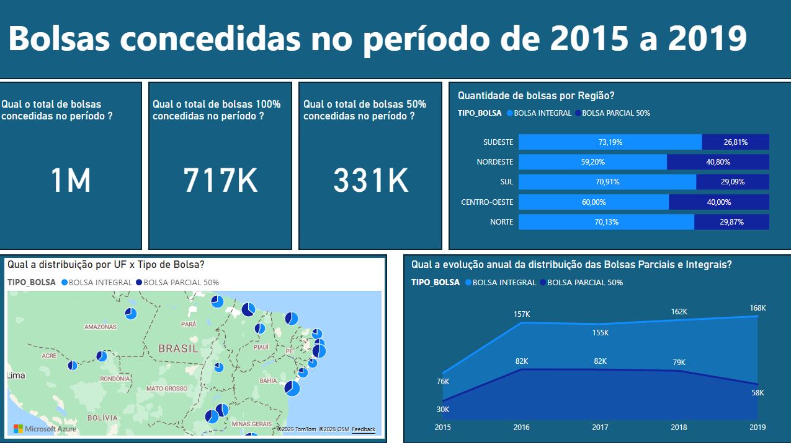
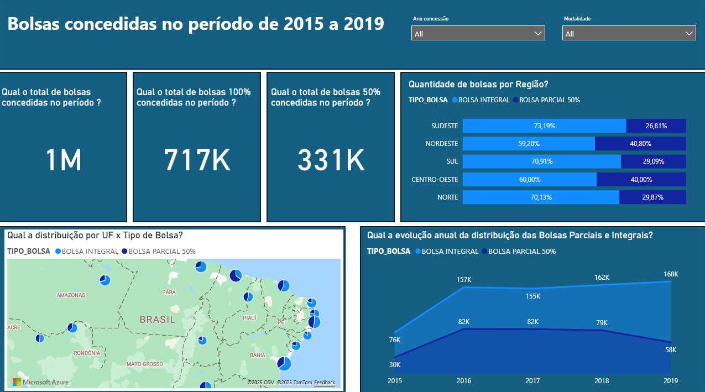
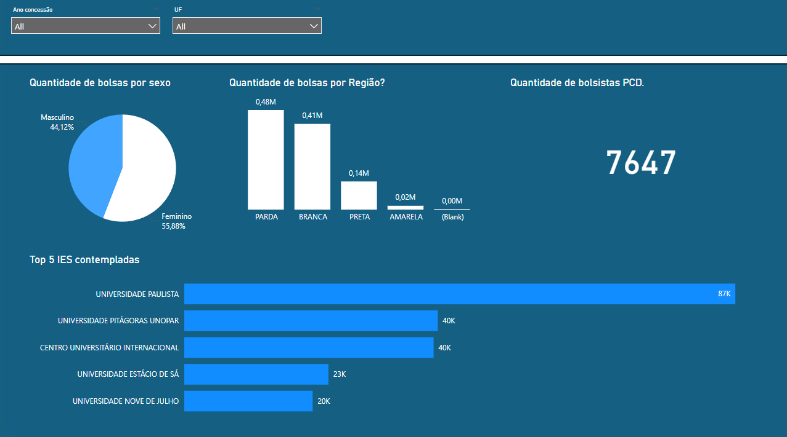

# ProUNI - 2015 a 2019

----

Este projeto de Business Intelligence oferece uma análise abrangente do programa ProUNI, explorando dados de 2015 a 2019.

### Visão Estratégica
A visão estratégica apresenta um panorama de alto nível, com indicadores-chave que auxiliam na tomada de decisões e no planejamento de longo prazo para o programa.

### Visão Analítica
A visão analítica aprofunda-se nos dados, permitindo a exploração de tendências e a identificação de padrões que influenciam.

### Visão Operacional
A visão operacional foca nos detalhes, fornecendo informações essenciais para a gestão e o acompanhamento de metas.

